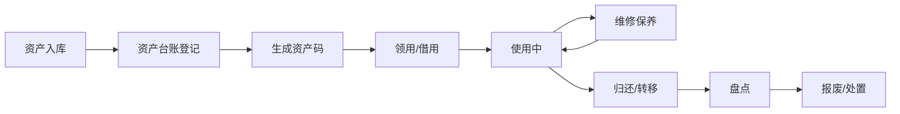

## 1. 产品概述

企业资产管理桌面客户端是面向行政和设备管理员的固定资产管理系统，用于统一管理办公设备、工装和低值易耗品，实现资产全生命周期管理，提升资产利用率，降低管理成本。

- 目标用户：企业行政人员、设备管理员、财务人员
- 核心价值：资产可视化、流程规范化、数据可追溯、决策数据化

## 2. 核心功能

### 2.1 用户角色

| 角色 | 登录方式 | 核心权限 |
|------|---------|---------|
| 管理员 | 账号登录 | 全部功能：资产台账、领用归还、维修保养、盘点任务、统计报表 |
| 普通员工 | 账号登录 | 资产查询、个人资产领用申请、个人资产归还 |

### 2.2 功能模块

1. **资产台账**：资产卡片管理、资产列表、筛选查询、资产码打印/扫描、操作记录
2. **领用归还**：员工领用、资产转移、借用登记、归还登记
3. **维修保养**：维修单登记、保养计划、到期提醒、维修记录
4. **盘点任务**：盘点清单、批量导入、盘盈盘亏标记、盘点报告
5. **统计报表**：资产概览、闲置率分析、折旧概览、明细导出

### 2.3 页面详情

| 页面名称 | 模块名称 | 功能描述 |
|---------|---------|---------|
| 资产台账 | 资产列表 | 按类别/地点/责任人筛选，搜索资产卡片展示 |
| 资产台账 | 新增资产 | 填写资产信息，生成资产编码，上传图片 |
| 资产台账 | 资产详情 | 查看资产完整信息、操作记录、状态流转 |
| 资产台账 | 资产码管理 | 生成二维码/条形码，打印标签 |
| 领用归还 | 领用管理 | 员工领用登记，选择资产，记录领用人、领用日期、预计归还日期 |
| 领用归还 | 归还管理 | 归还登记，检查资产状态，更新责任人 |
| 领用归还 | 转移管理 | 资产在部门/人员之间转移，记录转移记录 |
| 领用归还 | 借用管理 | 临时借用登记，设置借用期限 |
| 维修保养 | 维修单 | 故障报修、维修中、已完成状态流转 |
| 维修保养 | 保养计划 | 定期保养计划设置，到期提醒 |
| 维修保养 | 维修记录 | 历史维修记录查询，维修费用统计 |
| 盘点任务 | 盘点列表 | 创建盘点任务，设置盘点范围和时间 |
| 盘点任务 | 盘点执行 | 批量导入盘点清单，标记盘盈盘亏 |
| 盘点任务 | 盘点报告 | 盘点结果统计，差异分析 |
| 统计报表 | 资产概览 | 资产总数、总价值、分类统计 |
| 统计报表 | 闲置率分析 | 按类别、部门闲置资产统计 |
| 统计报表 | 折旧概览 | 资产折旧计算，净值统计 |
| 统计报表 | 导出 | 明细表导出Excel |

## 3. 核心流程

## 4. 用户界面设计

### 4.1 设计风格

- **主色调**：深蓝色系（专业、稳重），主色 #1e3a5f，辅助色 #3b82f6
- **按钮风格**：圆角矩形，轻微阴影，hover 态有颜色变化
- **字体**：系统默认字体，清晰易读
- **布局风格**：左侧导航栏 + 右侧内容区，卡片式布局
- **图标风格**：线性图标，统一风格简洁

### 4.2 页面设计概览

| 页面名称 | 模块名称 | UI元素 |
|---------|---------|-------|
| 资产台账 | 列表页 | 顶部筛选栏、数据表格、分页、操作按钮 |
| 资产台账 | 新增弹窗 | 表单、步骤条、表单验证 |
| 领用归还 | 标签页 | Tab切换、数据列表、操作按钮 |
| 维修保养 | 卡片列表 | 状态标签、时间线、提醒标识 |
| 盘点任务 | 进度展示 | 进度条、统计卡片、差异列表 |
| 统计报表 | 图表展示 | 柱状图、饼图、数据卡片 |

### 4.3 响应式

- 桌面端优先设计，适配1366px及以上屏幕
- 表格支持横向滚动
- 弹窗适配不同屏幕尺寸

### 4.4 桌面客户端特性

- 窗口式布局，模拟桌面应用体验
- 标签页切换流畅过渡动画
- 状态实时更新数据
