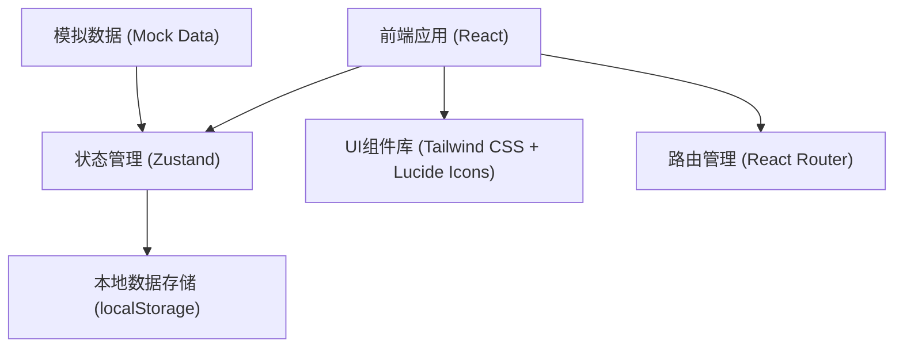
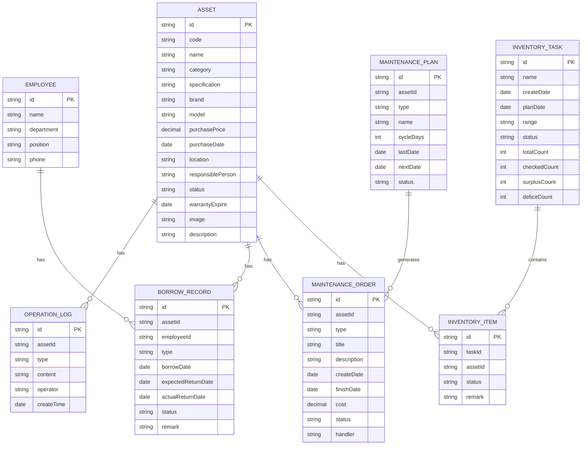

## 1. 架构设计



## 2. 技术描述

- **前端框架**：React 18 + TypeScript
- **构建工具**：Vite
- **样式方案**：Tailwind CSS 3
- **状态管理**：Zustand
- **路由**：React Router DOM
- **图标库**：Lucide React
- **数据存储**：localStorage 本地持久化
- **模拟数据**：内置 Mock 数据，支持演示

## 3. 路由定义

| 路由 | 页面 | 说明 |
|-----|-----|-----|
| /assets | 资产台账 | 资产列表、筛选、新增、详情 |
| /borrow | 领用归还 | 领用、归还、转移、借用 |
| /maintenance | 维修保养 | 维修单、保养计划、提醒 |
| /inventory | 盘点任务 | 盘点列表、执行、报告 |
| /reports | 统计报表 | 概览、闲置率、折旧、导出 |

## 4. 数据模型

### 4.1 数据模型定义



### 4.2 数据状态枚举

**资产状态**：
- idle: 闲置
- in_use: 使用中
- borrowed: 已借出
- maintenance: 维修中
- scrapped: 已报废

**领用/借用类型**：
- receive: 领用
- borrow: 借用
- transfer: 转移

**维修状态**：
- pending: 待处理
- repairing: 维修中
- completed: 已完成
- cancelled: 已取消

**盘点状态**：
- pending: 待开始
- ongoing: 进行中
- completed: 已完成

## 5. 项目结构

```
src/
├── components/          # 通用组件
│   ├── Layout/         # 布局组件
│   ├── Table/          # 表格组件
│   ├── Modal/          # 弹窗组件
│   ├── Form/           # 表单组件
│   └── StatusTag/      # 状态标签组件
├── pages/              # 页面组件
│   ├── Assets/         # 资产台账
│   ├── Borrow/         # 领用归还
│   ├── Maintenance/    # 维修保养
│   ├── Inventory/      # 盘点任务
│   └── Reports/        # 统计报表
├── store/              # 状态管理
│   ├── assetStore.ts
│   ├── borrowStore.ts
│   ├── maintenanceStore.ts
│   └── inventoryStore.ts
├── types/              # 类型定义
│   └── index.ts
├── data/               # 模拟数据
│   └── mockData.ts
├── utils/              # 工具函数
│   ├── date.ts
│   ├── export.ts
│   └── qrcode.ts
├── App.tsx
├── main.tsx
└── index.css
```
